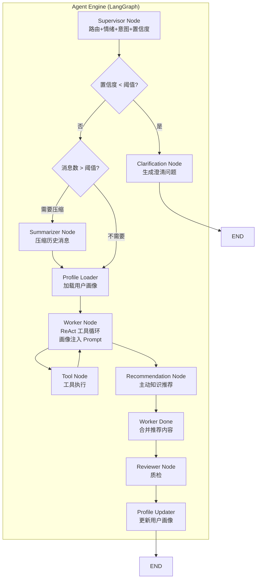
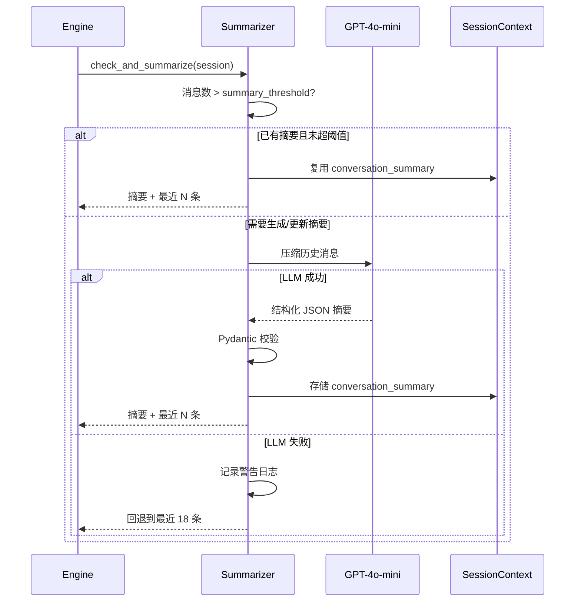

# 设计文档：Agent 智能化提升

## Overview

本设计文档描述"小智 AI 智能客服"系统的四项智能化增强能力：长会话摘要压缩、用户画像学习、主动知识推荐、多轮澄清机制，以及配套的摘要序列化模块。

当前系统基于 LangGraph 3-Agent 协作架构（Supervisor → Worker → Reviewer），后端 Python FastAPI + LangChain + OpenAI GPT-4o-mini。本次增强在现有架构上增量添加模块，不改变核心 Agent 图结构。

### 核心设计决策

| 决策 | 选择 | 理由 |
|------|------|------|
| 摘要生成方式 | LLM 驱动 + 结构化输出 | 比纯规则提取更准确，Pydantic 保证类型安全 |
| 画像存储 | PostgreSQL 独立表 | 与 Session 解耦，支持跨会话累积 |
| 推荐触发时机 | Worker 完成主检索后同步执行 | 避免异步竞态，超时降级保证延迟可控 |
| 澄清检测位置 | Supervisor 节点之后、Worker 之前 | 复用已有的意图分类置信度，无需额外 LLM 调用 |
| 摘要序列化 | Pydantic model_dump/model_validate | 原生支持 JSON 往返，自带校验 |

### 设计原则

- **渐进式集成**：新模块通过 LangGraph 条件边和节点注入，不修改现有节点内部逻辑
- **优雅降级**：所有新增能力失败时回退到现有行为（截取最近 18 条、默认画像、无推荐、直接回答）
- **配置驱动**：所有阈值通过 `config.yaml` 管理，支持环境变量覆盖

## Architecture

### 增强后的 Agent 图流程



### 新增模块目录结构

```
server/
├── agent/
│   ├── engine.py              # (改造) 集成新节点到 LangGraph 图
│   ├── summarizer.py          # (新增) 长会话摘要压缩模块
│   ├── clarification.py       # (新增) 多轮澄清检测与生成
│   ├── recommendation.py      # (新增) 主动知识推荐引擎
│   └── tools.py               # (不变)
├── core/
│   ├── models.py              # (扩展) 新增 ConversationSummary, UserProfile 等模型
│   └── config.py              # (扩展) 新增配置项
├── data/
│   ├── session_store.py       # (不变)
│   ├── profile_store.py       # (新增) 用户画像持久化
│   └── knowledge_base.py      # (不变)
```


## Components and Interfaces

### 1. 长会话摘要压缩模块 (`server/agent/summarizer.py`) — 需求 1, 5

#### 设计目标

当会话消息数超过可配置阈值（默认 20 条）时，使用 LLM 将早期历史压缩为结构化摘要，替代当前硬编码的"取最近 18 条"策略。

#### 摘要生成流程



#### 核心接口

```python
# server/agent/summarizer.py

class Summarizer:
    """长会话摘要压缩器"""

    def __init__(self, llm: ChatOpenAI, config: AppConfig):
        self._llm = llm
        self._threshold = config.summary_threshold        # 默认 20
        self._recent_count = config.summary_recent_count  # 默认 8

    async def check_and_summarize(
        self, session: Session
    ) -> list[BaseMessage]:
        """
        检查是否需要摘要，返回用于 LLM 的消息列表。
        
        返回格式：
        - 需要摘要时: [SystemMessage(摘要内容)] + 最近 N 条原始消息
        - 不需要时: 全部原始消息
        - LLM 失败时: 最近 18 条原始消息（回退策略）
        """

    async def _generate_summary(
        self, messages: list[Message]
    ) -> ConversationSummary:
        """调用 LLM 生成结构化摘要"""

    def _build_summary_prompt(
        self, messages: list[Message]
    ) -> list[BaseMessage]:
        """构建摘要生成的 Prompt"""
```

#### 摘要 Prompt 设计

```
你是一个对话摘要助手。请将以下客服对话历史压缩为结构化摘要。

要求：
1. 提取用户的核心诉求
2. 列出已解决和未解决的问题
3. 保留提及的订单号、手机型号等关键实体
4. 记录情绪变化趋势

以 JSON 格式输出：
{
  "summary_text": "摘要文本",
  "key_entities": ["实体1", "实体2"],
  "unresolved_issues": ["问题1"],
  "generated_at": 1234567890.0
}
```

### 2. 用户画像学习模块 — 需求 2

#### 画像推断逻辑

```python
# server/agent/profile_analyzer.py（内嵌于 engine.py 的画像更新逻辑）

class ProfileAnalyzer:
    """从对话内容推断用户画像维度"""

    def analyze_communication_style(
        self, messages: list[Message]
    ) -> str:
        """
        基于三个信号推断沟通风格：
        - 平均消息长度: > 100 字 → formal, < 30 字 → concise, 其他 → casual
        - 是否使用表情符号: 有 → casual
        - 用语正式程度: 包含"您好/请问/麻烦" → formal
        """

    def extract_frequent_topics(
        self, messages: list[Message], current_intent: IntentCategory
    ) -> list[str]:
        """从历史意图分类中提取高频主题"""

    def update_satisfaction(
        self, profile: UserProfile, sentiment: Sentiment
    ) -> list[float]:
        """根据情绪更新满意度趋势（0-1 映射）"""
```

#### 画像注入 Worker Prompt

在 Worker 节点执行前，将画像摘要注入 System Prompt：

```python
def _build_profile_prompt_segment(profile: UserProfile) -> str:
    """生成画像提示片段，附加到 WORKER_PROMPT 末尾"""
    style_hints = {
        "formal": "请使用正式、礼貌的语气回复，称呼用户为"您"",
        "casual": "可以使用轻松友好的语气，适当使用表情符号",
        "concise": "请尽量简洁回复，避免冗长解释",
    }
    hint = style_hints.get(profile.communication_style, "")
    topics = "、".join(profile.frequent_topics[:3]) if profile.frequent_topics else "无"
    return (
        f"\n\n**用户画像：**\n"
        f"- 沟通风格偏好：{hint}\n"
        f"- 高频咨询主题：{topics}\n"
        f"- 历史交互次数：{profile.interaction_count}\n"
    )
```

#### 画像持久化 (`server/data/profile_store.py`)

```python
class ProfileStore:
    """用户画像 PostgreSQL 持久化"""

    async def load(self, user_id: str) -> UserProfile | None:
        """加载用户画像，3 秒超时后返回 None"""

    async def save(self, profile: UserProfile) -> bool:
        """保存/更新用户画像，失败不阻塞"""
```

#### 数据库表设计

```sql
CREATE TABLE user_profiles (
    user_id VARCHAR(64) PRIMARY KEY,
    preferred_language VARCHAR(10) DEFAULT 'zh',
    communication_style VARCHAR(20) DEFAULT 'casual',
    frequent_topics JSONB DEFAULT '[]',
    satisfaction_history JSONB DEFAULT '[]',
    interaction_count INTEGER DEFAULT 0,
    created_at TIMESTAMPTZ DEFAULT NOW(),
    updated_at TIMESTAMPTZ DEFAULT NOW()
);

CREATE INDEX idx_profiles_updated ON user_profiles(updated_at DESC);
```

### 3. 主动知识推荐引擎 (`server/agent/recommendation.py`) — 需求 3

#### 意图→关联主题映射

```python
# 可配置的意图到推荐查询词映射
INTENT_TOPIC_MAP: dict[IntentCategory, list[str]] = {
    IntentCategory.REFUND_REQUEST: ["退换货流程", "售后政策"],
    IntentCategory.ORDER_STATUS: ["配送时效", "物流查询"],
    IntentCategory.PRODUCT_INQUIRY: ["回收价格标准", "手机成色等级"],
    IntentCategory.TECHNICAL_SUPPORT: ["常见问题FAQ", "故障排查"],
    IntentCategory.COMPLAINT: ["投诉处理流程", "售后保障"],
}
```

#### 推荐流程

```python
class RecommendationEngine:
    """主动知识推荐引擎"""

    def __init__(self, config: AppConfig):
        self._enabled = config.recommendation_enabled  # 可关闭
        self._timeout = config.recommendation_timeout   # 默认 2 秒
        self._max_items = 2

    async def get_recommendations(
        self,
        intent: IntentCategory,
        main_results: list[KnowledgeEntry],
        session_context: SessionContext,
    ) -> list[KnowledgeEntry]:
        """
        基于意图获取推荐知识，去重后返回最多 2 条。
        超时 2 秒自动放弃，返回空列表。
        """

    def _deduplicate(
        self,
        candidates: list[KnowledgeEntry],
        main_results: list[KnowledgeEntry],
    ) -> list[KnowledgeEntry]:
        """基于 ID 去重，过滤与主查询结果重复的条目"""
```

#### 推荐内容格式化

Worker 回复后，推荐内容以固定格式附加：

```
[主回复内容]

---
💡 您可能还想了解：
• [推荐知识标题1]：[摘要]
• [推荐知识标题2]：[摘要]
```

### 4. 多轮澄清机制 (`server/agent/clarification.py`) — 需求 4

#### 澄清检测与生成

```python
class ClarificationDetector:
    """意图澄清检测器"""

    def __init__(self, config: AppConfig):
        self._threshold = config.clarification_confidence_threshold  # 默认 0.4
        self._max_rounds = 2

    def should_clarify(
        self, confidence: float, session_context: SessionContext
    ) -> bool:
        """
        判断是否需要澄清：
        - 置信度 < 阈值
        - 且未超过最大澄清轮次
        """

    def generate_clarification(
        self, intent: IntentCategory, user_text: str
    ) -> str:
        """
        根据可能的意图生成选项式澄清问题。
        
        示例输出：
        "我不太确定您的具体需求，请问您是想：
         1. 查询退款进度
         2. 申请新的退款
         3. 了解退款政策
         请选择或直接描述您的问题。"
        """

    def should_escalate_to_human(
        self, session_context: SessionContext
    ) -> bool:
        """连续 2 轮澄清失败后触发转人工"""
```

#### 澄清选项模板

```python
CLARIFICATION_TEMPLATES: dict[IntentCategory, list[str]] = {
    IntentCategory.REFUND_REQUEST: [
        "查询退款进度",
        "申请新的退款",
        "了解退款政策",
    ],
    IntentCategory.ORDER_STATUS: [
        "查询订单物流状态",
        "修改订单信息",
        "取消订单",
    ],
    IntentCategory.PRODUCT_INQUIRY: [
        "查询手机回收价格",
        "了解手机成色标准",
        "咨询购买二手手机",
    ],
    IntentCategory.TECHNICAL_SUPPORT: [
        "设备故障报修",
        "App 使用问题",
        "账号相关问题",
    ],
}
```

#### 澄清状态管理

在 `SessionContext` 中新增字段追踪澄清状态：

```python
class SessionContext(BaseModel):
    # ... 现有字段 ...
    pending_clarification: bool = False
    clarification_round: int = 0
    original_ambiguous_message: str | None = None
```

#### Engine 集成：澄清后重新分类

当用户回复澄清问题后，Engine 将原始模糊消息与澄清回复合并，重新送入 Supervisor 进行意图分类：

```python
# 在 supervisor_node 中
if context.pending_clarification and context.original_ambiguous_message:
    # 合并原始消息 + 澄清回复
    combined_text = f"{context.original_ambiguous_message}\n用户补充：{user_text}"
    # 用合并文本重新分类
```

### 5. Engine 集成改造 (`server/agent/engine.py`)

#### LangGraph 图扩展

在现有图中插入新节点，通过条件边控制流程：

```python
def _build_graph() -> Any:
    g = StateGraph(AgentState)

    # 现有节点
    g.add_node("supervisor", supervisor_node)
    g.add_node("human_node", human_node)
    g.add_node("worker_node", worker_node)
    g.add_node("tool_node", tool_node)
    g.add_node("worker_done", worker_done)
    g.add_node("reviewer", reviewer_node)

    # 新增节点
    g.add_node("clarification_check", clarification_check_node)
    g.add_node("summary_check", summary_check_node)
    g.add_node("profile_load", profile_load_node)
    g.add_node("recommend", recommendation_node)
    g.add_node("profile_update", profile_update_node)

    g.set_entry_point("supervisor")

    # Supervisor → 澄清检查
    g.add_edge("supervisor", "clarification_check")

    # 澄清检查 → 需要澄清则直接返回 / 否则继续
    g.add_conditional_edges("clarification_check", clarification_route, {
        "clarify": END,          # 返回澄清问题
        "escalate": "human_node", # 连续失败转人工
        "continue": "summary_check",
    })

    # 摘要检查 → 画像加载
    g.add_edge("summary_check", "profile_load")

    # 画像加载 → Worker
    g.add_edge("profile_load", "worker_node")

    # Worker 工具循环（不变）
    g.add_conditional_edges("worker_node", worker_should_tool, {
        "tool_node": "tool_node",
        "worker_done": "recommend",  # 改为先推荐
    })
    g.add_edge("tool_node", "worker_node")

    # 推荐 → Worker Done → Reviewer → 画像更新
    g.add_edge("recommend", "worker_done")
    g.add_edge("worker_done", "reviewer")
    g.add_edge("reviewer", "profile_update")
    g.add_edge("profile_update", END)

    g.add_edge("human_node", END)

    return g.compile()
```

#### AgentState 扩展

```python
class AgentState(TypedDict):
    # ... 现有字段 ...
    user_profile: UserProfile | None       # 用户画像
    conversation_summary: str | None       # 会话摘要文本
    recommendations: list[KnowledgeEntry]  # 推荐知识条目
    needs_clarification: bool              # 是否需要澄清
    clarification_message: str | None      # 澄清问题文本
```


## Data Models

### 新增 Pydantic 模型

```python
# server/core/models.py 扩展

# ── 会话摘要 ──────────────────────────────────────────

class ConversationSummary(BaseModel):
    """结构化会话摘要（需求 1, 5）"""
    summary_text: str                                    # 摘要文本
    key_entities: list[str] = Field(default_factory=list)  # 关键实体（订单号、型号等）
    unresolved_issues: list[str] = Field(default_factory=list)  # 未解决问题
    generated_at: float = Field(default_factory=time.time)  # 生成时间戳

    @classmethod
    def empty(cls) -> "ConversationSummary":
        """返回空摘要（反序列化失败时的降级值）"""
        return cls(summary_text="", key_entities=[], unresolved_issues=[], generated_at=0.0)


# ── 用户画像 ──────────────────────────────────────────

class CommunicationStyle(str, Enum):
    FORMAL = "formal"
    CASUAL = "casual"
    CONCISE = "concise"


class UserProfile(BaseModel):
    """用户画像模型（需求 2）"""
    user_id: str
    preferred_language: str = "zh"
    communication_style: CommunicationStyle = CommunicationStyle.CASUAL
    frequent_topics: list[str] = Field(default_factory=list)
    satisfaction_history: list[float] = Field(default_factory=list)
    interaction_count: int = 0
    created_at: float = Field(default_factory=time.time)
    updated_at: float = Field(default_factory=time.time)

    @classmethod
    def default(cls, user_id: str) -> "UserProfile":
        """首次对话时的默认画像"""
        return cls(user_id=user_id)


# ── SessionContext 扩展 ───────────────────────────────

class SessionContext(BaseModel):
    # 现有字段
    user_name: Optional[str] = None
    language: str = "zh"
    sentiment_trend: list[Sentiment] = Field(default_factory=list)
    current_intent: Optional[IntentCategory] = None
    extracted_entities: dict[str, str] = Field(default_factory=dict)
    escalation_reason: Optional[str] = None
    ticket_id: Optional[str] = None

    # 新增：摘要相关（需求 1）
    conversation_summary: Optional[ConversationSummary] = None

    # 新增：澄清相关（需求 4）
    pending_clarification: bool = False
    clarification_round: int = 0
    original_ambiguous_message: Optional[str] = None


# ── MessageMetadata 扩展 ──────────────────────────────

class MessageMetadata(BaseModel):
    # 现有字段 ...
    
    # 新增：推荐相关（需求 3）
    recommended_knowledge_ids: list[str] = Field(default_factory=list)
    
    # 新增：澄清相关（需求 4）
    clarification_triggered: bool = False
    clarification_round: int = 0
```

### 配置扩展 (`config.yaml`)

```yaml
# ── 长会话摘要 ───────────────────────────────────────
summary_threshold: 20          # 触发摘要的消息数阈值
summary_recent_count: 8        # 摘要后保留的最近消息数

# ── 用户画像 ─────────────────────────────────────────
profile_load_timeout: 3        # 画像加载超时（秒）

# ── 主动推荐 ─────────────────────────────────────────
recommendation_enabled: true   # 是否启用主动推荐
recommendation_timeout: 2      # 推荐检索超时（秒）

# ── 多轮澄清 ─────────────────────────────────────────
clarification_confidence_threshold: 0.4  # 澄清触发的置信度阈值
```

### AppConfig 扩展

```python
class AppConfig(BaseModel):
    # ... 现有字段 ...

    # 长会话摘要（需求 1）
    summary_threshold: int = Field(default=20, ge=5)
    summary_recent_count: int = Field(default=8, ge=2)

    # 用户画像（需求 2）
    profile_load_timeout: int = Field(default=3, ge=1)

    # 主动推荐（需求 3）
    recommendation_enabled: bool = True
    recommendation_timeout: int = Field(default=2, ge=1)

    # 多轮澄清（需求 4）
    clarification_confidence_threshold: float = Field(default=0.4, ge=0.0, le=1.0)
```

### 数据库 Schema 扩展

```sql
-- 用户画像表（需求 2）
CREATE TABLE user_profiles (
    user_id VARCHAR(64) PRIMARY KEY,
    preferred_language VARCHAR(10) NOT NULL DEFAULT 'zh',
    communication_style VARCHAR(20) NOT NULL DEFAULT 'casual',
    frequent_topics JSONB NOT NULL DEFAULT '[]',
    satisfaction_history JSONB NOT NULL DEFAULT '[]',
    interaction_count INTEGER NOT NULL DEFAULT 0,
    created_at TIMESTAMPTZ DEFAULT NOW(),
    updated_at TIMESTAMPTZ DEFAULT NOW()
);

CREATE INDEX idx_profiles_updated ON user_profiles(updated_at DESC);

-- sessions 表的 context 字段已包含 conversation_summary，无需新增列
```


## Correctness Properties

*A property is a characteristic or behavior that should hold true across all valid executions of a system — essentially, a formal statement about what the system should do. Properties serve as the bridge between human-readable specifications and machine-verifiable correctness guarantees.*

### Property 1: 摘要触发逻辑正确性

*For any* 会话（包含任意数量的消息）和任意摘要阈值配置，摘要生成 SHALL 仅在以下条件满足时触发：消息数 > 阈值 且 不存在可复用的已有摘要。当已有摘要存在且消息数未重新超过阈值时，SHALL 直接复用已有摘要而不调用 LLM。

**Validates: Requirements 1.1, 1.7**

### Property 2: 摘要后消息列表结构正确性

*For any* 包含有效摘要的会话和任意 `summary_recent_count` 配置值 N，构建的 LLM 输入消息列表 SHALL 恰好包含 1 条摘要系统消息 + min(N, 实际消息数) 条最近的原始消息，且原始消息的顺序与会话中的顺序一致。

**Validates: Requirements 1.3**

### Property 3: 沟通风格推断规则一致性

*For any* 用户消息集合，`communication_style` 的推断 SHALL 遵循以下规则：若平均消息长度 > 100 字或包含正式用语标记（"您好"/"请问"/"麻烦"），则为 `formal`；若平均消息长度 < 30 字且不含正式用语标记，则为 `concise`；其余情况为 `casual`。包含表情符号时 SHALL 倾向 `casual`。

**Validates: Requirements 2.7**

### Property 4: 画像 Prompt 注入完整性

*For any* 有效的 UserProfile 对象，生成的 Prompt 片段 SHALL 包含该画像的 `communication_style` 对应的风格提示文本、`frequent_topics` 中的前 3 个主题、以及 `interaction_count` 数值。

**Validates: Requirements 2.4**

### Property 5: 推荐知识不变量

*For any* 意图类型、主查询结果列表和候选推荐列表，推荐引擎的输出 SHALL 满足：(a) 条目数 ≤ 2，(b) 输出中无任何条目的 ID 与主查询结果重复，(c) 输出中每个条目的 ID 都记录在 MessageMetadata.recommended_knowledge_ids 中。

**Validates: Requirements 3.1, 3.3, 3.6**

### Property 6: 推荐内容格式化正确性

*For any* 主回复文本和非空推荐知识列表，格式化后的输出 SHALL 包含"您可能还想了解"分隔标记，且每条推荐知识的标题都出现在输出中。当推荐列表为空时，输出 SHALL 与原始主回复完全相同。

**Validates: Requirements 3.4**

### Property 7: 澄清路由决策正确性

*For any* 置信度值、澄清轮次和置信度阈值配置，系统路由 SHALL 满足：(a) 当置信度 < 阈值 且 轮次 < 2 时，触发澄清；(b) 当轮次 ≥ 2 且置信度仍 < 阈值时，触发转人工；(c) 当置信度 ≥ 阈值时，正常继续处理。

**Validates: Requirements 4.1, 4.6**

### Property 8: 澄清问题选项生成

*For any* 在 CLARIFICATION_TEMPLATES 中有映射的意图类型，生成的澄清问题 SHALL 包含该意图对应模板中的所有选项文本，且选项以编号列表形式呈现。

**Validates: Requirements 4.2, 4.3**

### Property 9: 澄清状态一致性

*For any* 触发澄清的消息处理，SessionContext 中的 `pending_clarification` SHALL 为 True，`original_ambiguous_message` SHALL 等于原始用户消息，`clarification_round` SHALL 递增 1；同时 MessageMetadata 中的 `clarification_triggered` SHALL 为 True，`clarification_round` SHALL 与 SessionContext 中的值一致。

**Validates: Requirements 4.4, 4.8**

### Property 10: 澄清消息合并完整性

*For any* 原始模糊消息和用户澄清回复，合并后的文本 SHALL 同时包含原始消息内容和澄清回复内容。

**Validates: Requirements 4.5**

### Property 11: 摘要序列化往返一致性

*For any* 有效的 ConversationSummary 对象（包含任意 summary_text、key_entities 列表、unresolved_issues 列表和 generated_at 时间戳），序列化为 JSON 后再反序列化 SHALL 产生与原始对象字段值完全等价的对象。

**Validates: Requirements 5.2**

### Property 12: 异常 JSON 反序列化容错

*For any* 非法 JSON 字符串（包括空字符串、截断的 JSON、缺少必填字段的 JSON、类型错误的 JSON），反序列化函数 SHALL 返回空摘要对象（summary_text 为空字符串）而不抛出异常。

**Validates: Requirements 5.3**

## Error Handling

### 降级策略总览

| 模块 | 失败场景 | 降级行为 | 日志级别 |
|------|----------|----------|----------|
| Summarizer | LLM 调用失败 | 回退到截取最近 18 条消息 | WARNING |
| Summarizer | JSON 解析失败 | 返回空摘要，继续使用原始消息 | ERROR |
| ProfileStore | 数据库加载超时（3s） | 使用默认画像 | WARNING |
| ProfileStore | 数据库写入失败 | 跳过持久化，不阻塞回复 | ERROR |
| RecommendationEngine | 检索超时（2s） | 放弃推荐，仅返回主回复 | WARNING |
| RecommendationEngine | RAG 检索异常 | 返回空推荐列表 | ERROR |
| ClarificationDetector | 模板缺失 | 生成通用澄清问题 | WARNING |
| ClarificationDetector | 连续 2 轮失败 | 自动转人工 | INFO |

### 关键错误处理逻辑

```python
# Summarizer 降级
async def check_and_summarize(self, session: Session) -> list[BaseMessage]:
    if len(session.messages) <= self._threshold:
        # 不需要摘要，复用已有或返回全部
        if session.context.conversation_summary:
            return self._build_with_summary(session)
        return self._build_raw_messages(session)
    
    try:
        summary = await self._generate_summary(session.messages)
        session.context.conversation_summary = summary
        return self._build_with_summary(session)
    except Exception as e:
        logger.warning("summary_generation_failed", exc_info=e)
        # 回退到最近 18 条
        return self._build_raw_messages(session, limit=18)


# ProfileStore 超时降级
async def load_with_timeout(self, user_id: str, timeout: int = 3) -> UserProfile:
    try:
        profile = await asyncio.wait_for(
            self.load(user_id), timeout=timeout
        )
        return profile or UserProfile.default(user_id)
    except asyncio.TimeoutError:
        logger.warning("profile_load_timeout", extra={"extra_fields": {
            "user_id": user_id, "timeout_s": timeout,
        }})
        return UserProfile.default(user_id)


# RecommendationEngine 超时降级
async def get_recommendations(self, ...) -> list[KnowledgeEntry]:
    if not self._enabled:
        return []
    try:
        return await asyncio.wait_for(
            self._fetch_recommendations(...), timeout=self._timeout
        )
    except asyncio.TimeoutError:
        logger.warning("recommendation_timeout")
        return []
```

## Testing Strategy

### 测试框架选择

- **单元测试**：`pytest` + `pytest-asyncio`
- **属性测试**：`hypothesis`（Python 生态最成熟的 PBT 库）
- **Mock**：`unittest.mock` / `pytest-mock`

### 属性测试配置

每个属性测试最少运行 100 次迭代，使用 `@settings(max_examples=100)` 配置。

每个属性测试通过注释标注对应的设计文档属性：

```python
# Feature: agent-intelligence-enhancement, Property 11: 摘要序列化往返一致性
@given(summary=st.builds(ConversationSummary, ...))
@settings(max_examples=100)
def test_summary_round_trip(summary):
    ...
```

### 测试分层

#### 属性测试（Property-Based Tests）

| 属性 | 测试文件 | 生成器 |
|------|----------|--------|
| P1: 摘要触发逻辑 | `test_summarizer_properties.py` | 随机消息列表 + 随机阈值 |
| P2: 消息列表结构 | `test_summarizer_properties.py` | 随机摘要 + 随机 recent_count |
| P3: 风格推断 | `test_profile_properties.py` | 随机消息集合（变长、含/不含表情） |
| P4: Prompt 注入 | `test_profile_properties.py` | 随机 UserProfile |
| P5: 推荐不变量 | `test_recommendation_properties.py` | 随机意图 + 随机知识条目列表 |
| P6: 推荐格式化 | `test_recommendation_properties.py` | 随机回复文本 + 随机推荐列表 |
| P7: 澄清路由 | `test_clarification_properties.py` | 随机置信度 + 随机轮次 + 随机阈值 |
| P8: 澄清选项 | `test_clarification_properties.py` | 随机意图类型 |
| P9: 澄清状态 | `test_clarification_properties.py` | 随机消息 + 随机上下文 |
| P10: 消息合并 | `test_clarification_properties.py` | 随机字符串对 |
| P11: 序列化往返 | `test_summary_serialization_properties.py` | 随机 ConversationSummary |
| P12: 异常 JSON 容错 | `test_summary_serialization_properties.py` | 随机非法 JSON 字符串 |

#### 单元测试（Example-Based Tests）

- 摘要存储到 SessionContext（需求 1.4）
- LLM 失败回退到 18 条（需求 1.5）
- 首次对话使用默认画像（需求 2.5）
- 画像加载超时降级（需求 2.6）
- 推荐功能关闭时跳过（需求 3.5）
- 推荐超时降级（需求 3.7）
- 配置项存在性验证（需求 1.6, 4.7）

#### 集成测试

- 画像 PostgreSQL 持久化往返（需求 2.3）
- 完整 Agent 图流程：摘要 → 画像 → 回复 → 推荐 → 画像更新
- 澄清流程端到端：低置信度 → 澄清 → 回复 → 重新分类
