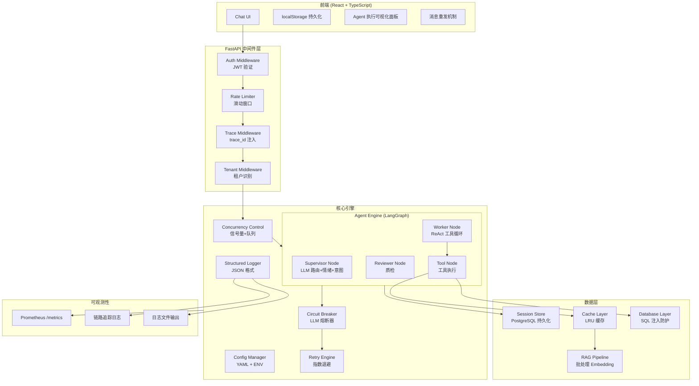

# Design Document: Enterprise Agent Optimization

## Overview

本设计文档描述将"小智 AI 智能客服"系统从原型级升级为企业级生产系统的技术方案。当前系统基于 LangGraph 3-Agent 协作架构（Supervisor → Worker → Reviewer），后端 FastAPI + Python，前端 React + TypeScript。

本次优化覆盖 15 个需求方向：

1. **可观测性**（需求 1-2）：结构化日志、链路追踪、Prometheus 指标
2. **持久化**（需求 3）：会话数据 PostgreSQL 持久化
3. **安全**（需求 4-6）：JWT 认证、速率限制、SQL 注入防护
4. **容错**（需求 7）：重试、熔断、降级
5. **性能**（需求 8-10）：缓存层、Embedding 批处理、并发控制
6. **配置管理**（需求 11）：集中式 YAML 配置
7. **前端体验**（需求 12, 15）：消息可靠性、Agent 执行可视化
8. **多租户**（需求 13）：租户隔离
9. **Agent 智能化**（需求 14）：LLM 驱动的情绪/意图分析

### 设计原则

- **渐进式改造**：在现有代码结构上增量添加模块，不做大规模重构
- **关注点分离**：每个优化方向封装为独立模块，通过 FastAPI 中间件或依赖注入集成
- **优雅降级**：所有新增组件失败时回退到现有行为，不影响核心对话能力
- **配置驱动**：所有阈值、开关通过集中配置管理，支持环境变量覆盖

## Architecture

### 整体架构图



### 新增模块目录结构

```
server/
├── config.py              # 集中式配置管理 (需求 11)
├── logging_config.py      # 结构化日志系统 (需求 1)
├── tracing.py             # 链路追踪与指标 (需求 2)
├── auth.py                # JWT 认证中间件 (需求 4)
├── rate_limiter.py        # 速率限制 (需求 5)
├── sql_guard.py           # SQL 注入防护 (需求 6)
├── circuit_breaker.py     # 熔断器 (需求 7)
├── retry.py               # 重试引擎 (需求 7)
├── cache.py               # LRU 缓存层 (需求 8)
├── session_store.py       # 会话持久化 (需求 3)
├── concurrency.py         # 并发控制 (需求 10)
├── tenant.py              # 多租户支持 (需求 13)
├── agent.py               # (改造) Agent 引擎集成新模块
├── knowledge_base.py      # (改造) 批处理 Embedding (需求 9)
├── database.py            # (改造) SQL 防护加固 (需求 6)
├── tools.py               # (改造) 工具异常处理
├── models.py              # (改造) 新增数据模型
├── main.py                # (改造) 中间件注册、/metrics 端点
src/
├── api.ts                 # (改造) SSE 重连、Agent 事件解析
├── App.tsx                # (改造) 消息重发、localStorage、执行可视化
```

## Components and Interfaces

### 1. 结构化日志系统 (`server/logging_config.py`) — 需求 1

这是用户特别关注的模块，以下给出详细技术方案。

#### 设计目标

将当前散落在各模块中的 `print()` 调用替换为统一的结构化日志系统，输出 JSON 格式日志，支持链路追踪关联。

#### 核心实现方案

基于 Python 标准库 `logging` + 自定义 `JSONFormatter`，不引入额外依赖。

```python
# server/logging_config.py

import json
import logging
import sys
import traceback
from datetime import datetime, timezone
from contextvars import ContextVar

# 请求级上下文变量，用于在异步调用链中传递 trace 信息
trace_id_var: ContextVar[str] = ContextVar("trace_id", default="")
session_id_var: ContextVar[str] = ContextVar("session_id", default="")
user_id_var: ContextVar[str] = ContextVar("user_id", default="")
tenant_id_var: ContextVar[str] = ContextVar("tenant_id", default="default")


class JSONFormatter(logging.Formatter):
    """将日志记录格式化为单行 JSON，满足需求 1.1"""

    def format(self, record: logging.LogRecord) -> str:
        log_entry = {
            "timestamp": datetime.now(timezone.utc).isoformat(),
            "level": record.levelname,
            "module": record.module,
            "message": record.getMessage(),
            "trace_id": trace_id_var.get(""),
            "session_id": session_id_var.get(""),
            "user_id": user_id_var.get(""),
            "tenant_id": tenant_id_var.get("default"),
        }

        # 附加自定义字段（通过 extra 传入）
        if hasattr(record, "extra_fields"):
            log_entry.update(record.extra_fields)

        # 异常信息（需求 1.3）
        if record.exc_info and record.exc_info[0]:
            log_entry["exception"] = {
                "type": record.exc_info[0].__name__,
                "message": str(record.exc_info[1]),
                "stack_summary": traceback.format_exception(
                    *record.exc_info
                )[-3:],  # 只保留最后 3 帧摘要
            }

        return json.dumps(log_entry, ensure_ascii=False, default=str)


def setup_logging(level: str = "INFO", log_file: str | None = None) -> None:
    """
    初始化日志系统（需求 1.4, 1.5）
    - level: 通过环境变量 LOG_LEVEL 配置
    - log_file: 通过环境变量 LOG_FILE 配置
    """
    root = logging.getLogger()
    root.setLevel(getattr(logging, level.upper(), logging.INFO))
    root.handlers.clear()

    formatter = JSONFormatter()

    # stdout handler（需求 1.5）
    stdout_handler = logging.StreamHandler(sys.stdout)
    stdout_handler.setFormatter(formatter)
    root.addHandler(stdout_handler)

    # 文件 handler（需求 1.5）
    if log_file:
        file_handler = logging.FileHandler(log_file, encoding="utf-8")
        file_handler.setFormatter(formatter)
        root.addHandler(file_handler)
```

#### 上下文传递机制

使用 Python `contextvars` 在异步调用链中传递 trace_id、session_id 等上下文信息，无需手动传参：

```python
# 在 FastAPI 中间件中设置上下文
async def trace_middleware(request, call_next):
    trace_id = request.headers.get("X-Trace-ID", uuid.uuid4().hex)
    trace_id_var.set(trace_id)
    response = await call_next(request)
    response.headers["X-Trace-ID"] = trace_id
    return response
```

#### Agent 处理链路日志（需求 1.2）

在 Agent 图的每个节点入口/出口插入日志记录：

```python
logger = logging.getLogger("agent")

def supervisor_node(state):
    node_start = time.time()
    session_id_var.set(state.get("session_id", ""))
    logger.info("node_enter", extra={"extra_fields": {
        "node": "supervisor", "event": "enter"
    }})
    # ... 原有逻辑 ...
    logger.info("node_exit", extra={"extra_fields": {
        "node": "supervisor", "event": "exit",
        "duration_ms": int((time.time() - node_start) * 1000),
        "sentiment": sentiment.value,
        "intent": intent.value,
    }})
```

#### 日志级别使用规范

| 级别 | 使用场景 |
|------|----------|
| DEBUG | Agent 状态详情、工具输入输出完整内容 |
| INFO | 节点进入/退出、请求开始/完成、缓存命中 |
| WARNING | Token 验证失败、速率限制触发、降级回退 |
| ERROR | LLM 调用失败、数据库写入失败、未捕获异常 |

### 2. 链路追踪与指标监控 (`server/tracing.py`) — 需求 2

#### trace_id 生成与传递（需求 2.1）

```python
# 每次请求在中间件层生成 trace_id，存入 contextvars
# Agent 图内所有节点通过 contextvars 自动获取，无需显式传参
```

#### 节点耗时记录（需求 2.2, 2.4）

在 LangGraph 图中为每个节点包装计时装饰器：

```python
def timed_node(node_name: str):
    def decorator(func):
        async def wrapper(state):
            start = time.time()
            result = func(state) if not asyncio.iscoroutinefunction(func) else await func(state)
            duration_ms = int((time.time() - start) * 1000)
            NODE_DURATION.labels(node=node_name).observe(duration_ms)
            logger.info("node_completed", extra={"extra_fields": {
                "node": node_name, "duration_ms": duration_ms
            }})
            return result
        return wrapper
    return decorator
```

#### Prometheus 指标端点（需求 2.3）

使用 `prometheus_client` 库暴露 `/metrics`：

```python
from prometheus_client import Counter, Histogram, Gauge, generate_latest

REQUEST_COUNT = Counter("agent_requests_total", "Total requests", ["endpoint", "status"])
REQUEST_LATENCY = Histogram("agent_request_duration_ms", "Request latency", ["endpoint"])
ACTIVE_SESSIONS = Gauge("agent_active_sessions", "Active sessions")
TOOL_CALLS = Counter("agent_tool_calls_total", "Tool calls", ["tool_name", "status"])
NODE_DURATION = Histogram("agent_node_duration_ms", "Node execution time", ["node"])

@app.get("/metrics")
async def metrics():
    return Response(generate_latest(), media_type="text/plain")
```

### 3. 会话持久化 (`server/session_store.py`) — 需求 3

#### 数据库表设计

```sql
CREATE TABLE sessions (
    id VARCHAR(64) PRIMARY KEY,
    user_id VARCHAR(64) NOT NULL,
    tenant_id VARCHAR(64) NOT NULL DEFAULT 'default',
    messages JSONB NOT NULL DEFAULT '[]',
    context JSONB NOT NULL DEFAULT '{}',
    status VARCHAR(20) NOT NULL DEFAULT 'active',
    satisfaction INTEGER,
    created_at TIMESTAMP WITH TIME ZONE DEFAULT NOW(),
    updated_at TIMESTAMP WITH TIME ZONE DEFAULT NOW()
);

CREATE INDEX idx_sessions_user_id ON sessions(user_id);
CREATE INDEX idx_sessions_tenant_id ON sessions(tenant_id);
CREATE INDEX idx_sessions_updated_at ON sessions(updated_at);
```

#### 接口设计

```python
class SessionStore:
    async def save(self, session: Session) -> bool:
        """持久化会话到 PostgreSQL，失败回退内存（需求 3.4）"""

    async def load(self, session_id: str) -> Session | None:
        """从数据库加载会话（需求 3.3）"""

    async def list_by_user(self, user_id: str, tenant_id: str) -> list[Session]:
        """按 user_id 查询历史会话（需求 3.5）"""

    async def upsert_messages(self, session_id: str, user_msg: Message, bot_msg: Message) -> bool:
        """追加消息到会话（需求 3.2）"""
```

使用 `asyncpg` 连接池进行异步数据库操作，写入失败时回退到内存 `dict` 并记录 ERROR 日志。

### 4. API 认证与鉴权 (`server/auth.py`) — 需求 4

#### JWT 验证中间件

```python
from fastapi import Request, HTTPException
from jose import jwt, JWTError

class AuthMiddleware:
    EXCLUDED_PATHS = {"/api/health", "/metrics", "/docs", "/openapi.json"}

    async def __call__(self, request: Request, call_next):
        if request.url.path in self.EXCLUDED_PATHS:
            return await call_next(request)

        token = request.headers.get("Authorization", "").removeprefix("Bearer ").strip()
        if not token:
            raise HTTPException(status_code=401, detail="Missing authentication token")

        try:
            payload = jwt.decode(token, self.secret_key, algorithms=["HS256"],
                                 options={"verify_exp": True, "verify_iss": True},
                                 issuer=self.issuer)
            request.state.user_id = payload.get("sub", "anonymous")
            request.state.tenant_id = payload.get("tenant_id", "default")
        except JWTError as e:
            logger.warning("auth_failed", extra={"extra_fields": {"error": str(e)}})
            raise HTTPException(status_code=401, detail="Invalid or expired token")

        return await call_next(request)
```

#### WebSocket 认证（需求 4.4）

在 WebSocket 握手阶段通过 query parameter 传递 token：

```python
@app.websocket("/ws")
async def websocket_endpoint(ws: WebSocket, token: str = Query(...)):
    payload = verify_jwt(token)  # 验证失败抛异常，拒绝连接
    await ws.accept()
```

### 5. 速率限制 (`server/rate_limiter.py`) — 需求 5

#### 滑动窗口算法（需求 5.4）

```python
class SlidingWindowRateLimiter:
    def __init__(self, max_requests: int = 30, window_seconds: int = 60):
        self._windows: dict[str, deque[float]] = defaultdict(deque)

    def is_allowed(self, key: str) -> tuple[bool, int]:
        """返回 (是否允许, 剩余等待秒数)"""
        now = time.time()
        window = self._windows[key]
        # 清除过期记录
        while window and window[0] < now - self._window_seconds:
            window.popleft()
        if len(window) >= self._max_requests:
            retry_after = int(window[0] + self._window_seconds - now) + 1
            return False, retry_after
        window.append(now)
        return True, 0
```

限制键支持 IP 或 user_id（需求 5.1），超限返回 429 + `Retry-After` 头（需求 5.3）。

### 6. SQL 注入防护加固 (`server/sql_guard.py`) — 需求 6

#### SQL 语法解析

使用 `sqlparse` 库对 Agent 生成的 SQL 进行 AST 级别验证：

```python
import sqlparse

class SQLGuard:
    def validate(self, sql: str) -> tuple[bool, str]:
        parsed = sqlparse.parse(sql)
        if len(parsed) != 1:
            return False, "仅允许单条 SQL 语句"

        stmt = parsed[0]
        if stmt.get_type() != "SELECT":
            return False, "仅允许 SELECT 查询"

        # 检查子查询嵌套深度（需求 6.3）
        depth = self._count_subquery_depth(stmt)
        if depth > 2:
            return False, f"子查询嵌套层数 {depth} 超过限制(2)"

        # 检查 UNION（需求 6.3）
        sql_upper = sql.upper()
        if "UNION" in sql_upper:
            return False, "不允许使用 UNION"

        return True, ""

    def _count_subquery_depth(self, token, depth=0) -> int:
        max_depth = depth
        for child in token.tokens:
            if isinstance(child, sqlparse.sql.Parenthesis):
                inner = child.tokens
                if any(t.ttype is sqlparse.tokens.DML and t.value.upper() == "SELECT" for t in inner):
                    max_depth = max(max_depth, self._count_subquery_depth(child, depth + 1))
            elif hasattr(child, 'tokens'):
                max_depth = max(max_depth, self._count_subquery_depth(child, depth))
        return max_depth
```

结果行数上限默认 50 行（需求 6.4），通过配置管理。

### 7. Agent 异常处理与重试 (`server/retry.py`, `server/circuit_breaker.py`) — 需求 7

#### 指数退避重试（需求 7.1）

```python
class RetryEngine:
    async def execute_with_retry(self, func, max_retries=3, base_delay=1.0):
        for attempt in range(max_retries + 1):
            try:
                return await func()
            except Exception as e:
                if attempt == max_retries:
                    raise
                delay = base_delay * (2 ** attempt)  # 1s, 2s, 4s
                logger.warning("retry_attempt", extra={"extra_fields": {
                    "attempt": attempt + 1, "delay_s": delay, "error": str(e)
                }})
                await asyncio.sleep(delay)
```

#### 熔断器（需求 7.4, 7.5）

```python
class CircuitBreaker:
    CLOSED = "closed"      # 正常
    OPEN = "open"          # 熔断
    HALF_OPEN = "half_open"  # 探测

    def __init__(self, failure_threshold=5, recovery_timeout=60):
        self.state = self.CLOSED
        self.failure_count = 0
        self.last_failure_time = 0.0

    async def call(self, func):
        if self.state == self.OPEN:
            if time.time() - self.last_failure_time > self.recovery_timeout:
                self.state = self.HALF_OPEN
            else:
                raise CircuitOpenError("Circuit breaker is open")

        try:
            result = await func()
            if self.state == self.HALF_OPEN:
                self.state = self.CLOSED
                self.failure_count = 0
            return result
        except Exception:
            self.failure_count += 1
            self.last_failure_time = time.time()
            if self.failure_count >= self.failure_threshold:
                self.state = self.OPEN
            raise
```

#### 工具异常处理（需求 7.2）

在 `tool_node` 中捕获工具执行异常，返回结构化错误信息给 Worker，让 Worker 自行决定替代方案：

```python
def tool_node(state):
    try:
        result = _tool_executor.invoke(state)
    except Exception as e:
        error_msg = ToolMessage(
            content=f"工具执行失败: {type(e).__name__}: {str(e)}。请尝试其他方式回答用户。",
            tool_call_id=last_tool_call_id
        )
        return {"messages": [error_msg]}
```

### 8. 缓存层 (`server/cache.py`) — 需求 8

#### LRU 缓存实现

```python
from collections import OrderedDict
import hashlib, time

class LRUCache:
    def __init__(self, max_size: int = 1000, ttl: int = 300):
        self._cache: OrderedDict[str, tuple[float, Any]] = OrderedDict()
        self._max_size = max_size
        self._ttl = ttl

    def get(self, key: str) -> Any | None:
        if key not in self._cache:
            return None
        ts, value = self._cache[key]
        if time.time() - ts > self._ttl:
            del self._cache[key]
            return None
        self._cache.move_to_end(key)
        return value

    def put(self, key: str, value: Any) -> None:
        if key in self._cache:
            self._cache.move_to_end(key)
        self._cache[key] = (time.time(), value)
        while len(self._cache) > self._max_size:
            self._cache.popitem(last=False)

    def invalidate_pattern(self, pattern: str) -> int:
        """清除匹配模式的缓存条目（需求 8.3）"""
        keys_to_remove = [k for k in self._cache if pattern in k]
        for k in keys_to_remove:
            del self._cache[k]
        return len(keys_to_remove)
```

缓存键为查询文本的 SHA256 哈希，知识库更新时调用 `invalidate_pattern` 清除相关缓存。

### 9. Embedding 批处理优化 — 需求 9

改造 `knowledge_base.py` 中的 `_build_or_load_faiss` 函数：

```python
async def _batch_embed(docs: list, batch_size: int = 32, delay_ms: int = 100):
    """分批发送 Embedding 请求（需求 9.1, 9.2）"""
    embeddings = _make_embeddings()
    all_vectors = []

    for i in range(0, len(docs), batch_size):
        batch = docs[i:i + batch_size]
        texts = [doc.page_content for doc in batch]

        for attempt in range(3):  # 最多重试 2 次（需求 9.3）
            try:
                vectors = embeddings.embed_documents(texts)
                all_vectors.extend(vectors)
                break
            except Exception as e:
                if attempt == 2:
                    logger.warning("embedding_batch_failed", extra={"extra_fields": {
                        "batch_index": i // batch_size, "error": str(e)
                    }})
                    # 跳过该批
                    all_vectors.extend([None] * len(texts))
                else:
                    await asyncio.sleep(delay_ms / 1000 * (attempt + 1))

        if i + batch_size < len(docs):
            await asyncio.sleep(delay_ms / 1000)

    return all_vectors
```

### 10. 并发控制 (`server/concurrency.py`) — 需求 10

```python
class ConcurrencyController:
    def __init__(self, max_concurrent: int = 20, queue_size: int = 50, timeout: int = 120):
        self._semaphore = asyncio.Semaphore(max_concurrent)
        self._queue_count = 0
        self._max_queue = queue_size
        self._timeout = timeout

    async def execute(self, coro):
        if self._semaphore.locked() and self._queue_count >= self._max_queue:
            raise HTTPException(status_code=503, detail="Server busy, please retry later")

        self._queue_count += 1
        try:
            async with self._semaphore:
                self._queue_count -= 1
                return await asyncio.wait_for(coro, timeout=self._timeout)
        except asyncio.TimeoutError:
            raise HTTPException(status_code=504, detail="Request timeout")
        finally:
            if self._queue_count > 0:
                self._queue_count -= 1
```

### 11. 集中式配置管理 (`server/config.py`) — 需求 11

```python
import yaml
from pydantic import BaseModel, Field, validator

class AppConfig(BaseModel):
    # LLM
    openai_api_key: str
    openai_base_url: str | None = None
    openai_model: str = "gpt-4o-mini"
    embedding_model: str = "text-embedding-3-small"

    # 日志
    log_level: str = "INFO"
    log_file: str | None = None

    # 认证
    jwt_secret: str = ""
    jwt_issuer: str = "xiaozhi"
    auth_enabled: bool = False

    # 速率限制
    rate_limit_rpm: int = 30
    rate_limit_enabled: bool = True

    # 缓存
    cache_ttl: int = 300
    cache_max_size: int = 1000

    # 并发
    max_concurrent_requests: int = 20
    request_timeout: int = 120

    # 数据库
    db_url: str = ""
    db_allowed_tables: list[str] = Field(default_factory=list)
    db_readonly: bool = True
    sql_max_rows: int = 50
    sql_max_subquery_depth: int = 2

    # Embedding 批处理
    embedding_batch_size: int = 32
    embedding_batch_delay_ms: int = 100

    # 熔断器
    circuit_breaker_threshold: int = 5
    circuit_breaker_recovery_s: int = 60

    # 多租户
    default_tenant_id: str = "default"

    @validator("log_level")
    def validate_log_level(cls, v):
        valid = {"DEBUG", "INFO", "WARNING", "ERROR"}
        if v.upper() not in valid:
            raise ValueError(f"log_level must be one of {valid}")
        return v.upper()


def load_config(config_path: str = "config.yaml") -> AppConfig:
    """从 YAML 加载配置，环境变量覆盖（需求 11.1）"""
    data = {}
    try:
        with open(config_path) as f:
            data = yaml.safe_load(f) or {}
    except FileNotFoundError:
        pass  # 允许无配置文件，全部走环境变量

    # 环境变量覆盖
    import os
    env_mapping = {
        "OPENAI_API_KEY": "openai_api_key",
        "OPENAI_BASE_URL": "openai_base_url",
        "OPENAI_MODEL": "openai_model",
        "LOG_LEVEL": "log_level",
        "LOG_FILE": "log_file",
        "JWT_SECRET": "jwt_secret",
        "DB_URL": "db_url",
        # ... 其他映射
    }
    for env_key, config_key in env_mapping.items():
        val = os.getenv(env_key)
        if val is not None:
            data[config_key] = val

    return AppConfig(**data)  # Pydantic 校验（需求 11.2, 11.4）
```

### 12. 前端消息可靠性 — 需求 12

#### 消息状态模型扩展

```typescript
interface ChatMessage {
  id: string;
  role: 'user' | 'assistant';
  content: string;
  timestamp: number;
  metadata?: ChatMetadata;
  status?: 'sending' | 'sent' | 'failed';  // 新增
}
```

#### localStorage 持久化（需求 12.3, 12.4）

```typescript
const STORAGE_KEY = 'xiaozhi_session';

function saveToStorage(sessionId: string, messages: ChatMessage[]) {
  localStorage.setItem(STORAGE_KEY, JSON.stringify({ sessionId, messages }));
}

function loadFromStorage(): { sessionId: string; messages: ChatMessage[] } | null {
  const raw = localStorage.getItem(STORAGE_KEY);
  return raw ? JSON.parse(raw) : null;
}
```

#### SSE 自动重连（需求 12.5）

在 `api.ts` 的 `sendMessageStream` 中添加重试逻辑，最多 3 次，间隔 3 秒。

### 13. 多租户支持 (`server/tenant.py`) — 需求 13

#### 租户中间件

从请求头 `X-Tenant-ID` 或 JWT payload 中提取 tenant_id，注入到 contextvars：

```python
class TenantMiddleware:
    async def __call__(self, request, call_next):
        tenant_id = (
            request.headers.get("X-Tenant-ID")
            or getattr(request.state, "tenant_id", None)
            or config.default_tenant_id
        )
        tenant_id_var.set(tenant_id)
        request.state.tenant_id = tenant_id
        return await call_next(request)
```

#### 数据隔离

- Session Store：所有查询加 `WHERE tenant_id = $1` 条件（需求 13.2）
- RAG Pipeline：按 tenant_id 加载不同知识库目录 `data/knowledge/{tenant_id}/`（需求 13.3）
- Rate Limiter：按 `{tenant_id}:{user_id}` 作为限流键，支持租户级配置（需求 13.5）

### 14. LLM 驱动的情绪/意图分析 — 需求 14

改造 `supervisor_node`，将路由、情绪、意图合并为单次 LLM 调用（需求 14.3）：

```python
SUPERVISOR_PROMPT_V2 = """分析用户消息，以 JSON 格式返回：
{
  "next": "worker" 或 "human",
  "sentiment": "positive|neutral|negative|frustrated|confused",
  "intent": "product_inquiry|order_status|refund_request|...",
  "confidence": 0.0-1.0
}
只返回 JSON，不要其他内容。"""
```

LLM 调用失败时回退到现有关键词规则（需求 14.4）。

### 15. Agent 执行过程可视化 — 需求 15

#### SSE 事件扩展

在 Agent 图执行过程中推送实时事件：

```python
# 新增 SSE 事件类型
{"type": "agent_event", "event": "node_start", "node": "supervisor", "timestamp": ...}
{"type": "agent_event", "event": "node_end", "node": "supervisor", "duration_ms": 120}
{"type": "agent_event", "event": "tool_call", "tool": "search_knowledge_tool", "duration_ms": 85}
```

#### 前端折叠面板

在消息气泡下方添加可展开的执行详情面板（需求 15.2, 15.4）：

```typescript
interface AgentEvent {
  event: 'node_start' | 'node_end' | 'tool_call';
  node?: string;
  tool?: string;
  duration_ms?: number;
  timestamp: number;
}

// 在 ChatMessage 中新增
interface ChatMessage {
  // ... 现有字段
  agentEvents?: AgentEvent[];  // 新增
}
```


## Data Models

### 新增/扩展 Pydantic 模型

```python
# server/models.py 扩展

# ── 配置相关 ──────────────────────────────────────────

class TenantConfig(BaseModel):
    """租户级配置"""
    tenant_id: str
    rate_limit_rpm: int = 30
    knowledge_dir: str = ""  # 空则使用默认知识库
    custom_prompts: dict[str, str] = Field(default_factory=dict)


# ── 可观测性 ──────────────────────────────────────────

class TraceContext(BaseModel):
    """链路追踪上下文"""
    trace_id: str
    session_id: str = ""
    user_id: str = ""
    tenant_id: str = "default"
    start_time: float = Field(default_factory=time.time)


class NodeSpan(BaseModel):
    """节点执行跨度"""
    node_name: str
    start_time: float
    end_time: float = 0.0
    duration_ms: int = 0
    status: str = "ok"  # ok | error
    metadata: dict[str, Any] = Field(default_factory=dict)


class RequestTrace(BaseModel):
    """完整请求追踪"""
    trace_id: str
    spans: list[NodeSpan] = Field(default_factory=list)
    total_duration_ms: int = 0
    tools_called: list[str] = Field(default_factory=list)


# ── Agent 事件（SSE 推送） ────────────────────────────

class AgentEvent(BaseModel):
    """Agent 执行事件，通过 SSE 推送到前端"""
    type: str = "agent_event"
    event: str  # node_start | node_end | tool_call
    node: str | None = None
    tool: str | None = None
    duration_ms: int | None = None
    timestamp: float = Field(default_factory=time.time)


# ── 会话持久化扩展 ────────────────────────────────────

class Session(BaseModel):
    """扩展 Session 模型，增加 tenant_id"""
    id: str = Field(default_factory=lambda: uuid.uuid4().hex)
    user_id: str = "anonymous"
    tenant_id: str = "default"  # 新增
    messages: list[Message] = Field(default_factory=list)
    context: SessionContext = Field(default_factory=SessionContext)
    created_at: float = Field(default_factory=time.time)
    updated_at: float = Field(default_factory=time.time)
    status: SessionStatus = SessionStatus.ACTIVE
    satisfaction: int | None = None


# ── 前端消息扩展 ──────────────────────────────────────

class MessageMetadata(BaseModel):
    """扩展 MessageMetadata，增加 trace_id"""
    sentiment: Sentiment | None = None
    intent: IntentCategory | None = None
    confidence: float | None = None
    language: str | None = None
    tools_used: list[str] = Field(default_factory=list)
    knowledge_refs: list[str] = Field(default_factory=list)
    response_time_ms: int | None = None
    trace_id: str | None = None  # 新增
    agent_events: list[AgentEvent] = Field(default_factory=list)  # 新增


# ── 熔断器状态 ────────────────────────────────────────

class CircuitState(str, Enum):
    CLOSED = "closed"
    OPEN = "open"
    HALF_OPEN = "half_open"


# ── 缓存条目 ──────────────────────────────────────────

class CacheEntry(BaseModel):
    key: str
    value: Any
    created_at: float = Field(default_factory=time.time)
    ttl: int = 300
```

### 数据库 Schema（PostgreSQL）

```sql
-- 会话表（需求 3）
CREATE TABLE sessions (
    id VARCHAR(64) PRIMARY KEY,
    user_id VARCHAR(64) NOT NULL,
    tenant_id VARCHAR(64) NOT NULL DEFAULT 'default',
    messages JSONB NOT NULL DEFAULT '[]',
    context JSONB NOT NULL DEFAULT '{}',
    status VARCHAR(20) NOT NULL DEFAULT 'active',
    satisfaction INTEGER CHECK (satisfaction BETWEEN 1 AND 5),
    created_at TIMESTAMPTZ DEFAULT NOW(),
    updated_at TIMESTAMPTZ DEFAULT NOW()
);

-- 索引
CREATE INDEX idx_sessions_user ON sessions(user_id);
CREATE INDEX idx_sessions_tenant ON sessions(tenant_id);
CREATE INDEX idx_sessions_status ON sessions(status);
CREATE INDEX idx_sessions_updated ON sessions(updated_at DESC);

-- 租户配置表（需求 13）
CREATE TABLE tenant_configs (
    tenant_id VARCHAR(64) PRIMARY KEY,
    rate_limit_rpm INTEGER DEFAULT 30,
    knowledge_dir VARCHAR(256) DEFAULT '',
    custom_prompts JSONB DEFAULT '{}',
    created_at TIMESTAMPTZ DEFAULT NOW()
);
```

### 前端 TypeScript 类型扩展

```typescript
// src/api.ts 扩展

export interface AgentEvent {
  event: 'node_start' | 'node_end' | 'tool_call';
  node?: string;
  tool?: string;
  duration_ms?: number;
  timestamp: number;
}

export interface ChatMetadata {
  sentiment?: string;
  intent?: string;
  confidence?: number;
  language?: string;
  toolsUsed?: string[];
  knowledgeRefs?: string[];
  responseTimeMs?: number;
  traceId?: string;          // 新增
  agentEvents?: AgentEvent[]; // 新增
}

// src/App.tsx 扩展
interface ChatMessage {
  id: string;
  role: 'user' | 'assistant';
  content: string;
  timestamp: number;
  metadata?: ChatMetadata;
  status?: 'sending' | 'sent' | 'failed';  // 新增：消息发送状态
  agentEvents?: AgentEvent[];               // 新增：Agent 执行事件
}
```


## Correctness Properties

*A property is a characteristic or behavior that should hold true across all valid executions of a system — essentially, a formal statement about what the system should do. Properties serve as the bridge between human-readable specifications and machine-verifiable correctness guarantees.*

### Property 1: JSON 日志格式完整性

*For any* log record with arbitrary level, module, message, and trace context, formatting it with JSONFormatter SHALL produce valid JSON containing all required fields: timestamp, level, module, message, trace_id.

**Validates: Requirements 1.1**

### Property 2: 异常日志结构完整性

*For any* exception of arbitrary type and message, logging it at ERROR level SHALL produce a log entry containing the exception type name, a stack summary (non-empty), and the triggering context.

**Validates: Requirements 1.3**

### Property 3: 会话持久化 Round Trip

*For any* valid Session object with arbitrary messages, context, and status, saving it to SessionStore then loading it by session_id SHALL produce a Session with equivalent messages, context, status, and satisfaction fields.

**Validates: Requirements 3.3**

### Property 4: 按用户查询会话完整性

*For any* set of sessions belonging to multiple users, querying SessionStore by a specific user_id SHALL return all and only sessions belonging to that user — no missing sessions and no sessions from other users.

**Validates: Requirements 3.5**

### Property 5: JWT 认证正确性

*For any* JWT token, the Auth module SHALL accept it if and only if the signature is valid, the token is not expired, and the issuer matches the configured value. All other tokens SHALL be rejected with HTTP 401.

**Validates: Requirements 4.1, 4.2, 4.3**

### Property 6: 滑动窗口速率限制

*For any* sequence of timestamped requests from a given key, the sliding window rate limiter SHALL allow at most `max_requests` within any `window_seconds` interval, and SHALL reject excess requests with a positive `Retry-After` value.

**Validates: Requirements 5.1, 5.3, 5.4**

### Property 7: SQL 安全验证

*For any* SQL string, the SQL guard SHALL accept it if and only if it is a single SELECT statement with subquery nesting depth ≤ 2 and no UNION keyword. All other SQL strings SHALL be rejected with a descriptive error message.

**Validates: Requirements 6.2, 6.3**

### Property 8: 指数退避重试

*For any* async function that fails N times then succeeds (where N ≤ max_retries), the retry engine SHALL execute exactly N+1 attempts with delays following the pattern `base_delay * 2^attempt` between consecutive attempts.

**Validates: Requirements 7.1**

### Property 9: 工具异常结构化处理

*For any* exception thrown during tool execution, the tool node SHALL catch it and return a structured error message containing the exception type and description, rather than propagating the exception.

**Validates: Requirements 7.2**

### Property 10: 熔断器状态转换

*For any* sequence of success/failure calls, the circuit breaker SHALL transition from CLOSED to OPEN after exactly `failure_threshold` consecutive failures, and SHALL transition from OPEN to HALF_OPEN after `recovery_timeout` seconds, and from HALF_OPEN to CLOSED on the next successful call.

**Validates: Requirements 7.4, 7.5**

### Property 11: 缓存 Round Trip 与 TTL 过期

*For any* cache key-value pair, getting the key within TTL after putting it SHALL return the original value, and getting the key after TTL has elapsed SHALL return None.

**Validates: Requirements 8.1, 8.2**

### Property 12: 缓存模式失效

*For any* set of cached entries and an invalidation pattern, calling `invalidate_pattern` SHALL remove all entries whose keys contain the pattern and SHALL preserve all entries whose keys do not contain the pattern.

**Validates: Requirements 8.3**

### Property 13: LRU 淘汰策略

*For any* sequence of cache put/get operations, the cache size SHALL never exceed `max_size`, and when eviction occurs, the least recently used entry (neither recently put nor recently accessed) SHALL be the one removed.

**Validates: Requirements 8.4**

### Property 14: Embedding 批处理分批约束

*For any* list of N documents and a batch_size B, the batching function SHALL produce ⌈N/B⌉ batches, each of size ≤ B, and the union of all batches SHALL equal the original document list (no duplicates, no omissions).

**Validates: Requirements 9.1**

### Property 15: 并发控制

*For any* number of concurrent requests, at most `max_concurrent` SHALL be processing simultaneously. When both the processing slots and the wait queue are full, additional requests SHALL receive HTTP 503.

**Validates: Requirements 10.1, 10.2**

### Property 16: 配置校验

*For any* configuration input where required fields are missing or field values do not match their expected format (e.g., invalid log level, non-numeric integer fields), the Config Manager SHALL raise a validation error with a specific message identifying the problematic field.

**Validates: Requirements 11.2, 11.4**

### Property 17: 环境变量覆盖配置文件

*For any* config key that exists in both the YAML file and as an environment variable, the loaded config value SHALL equal the environment variable value, not the YAML file value.

**Validates: Requirements 11.1**

### Property 18: 前端消息 localStorage Round Trip

*For any* array of ChatMessage objects with arbitrary content, saving to localStorage then loading SHALL produce an equivalent array with all fields preserved.

**Validates: Requirements 12.3**

### Property 19: 多租户会话隔离

*For any* two distinct tenant_ids, sessions created under tenant A SHALL NOT appear in query results for tenant B, and vice versa.

**Validates: Requirements 13.2**

### Property 20: 租户级速率限制独立性

*For any* two tenants with different configured rate limits, exhausting tenant A's rate limit SHALL NOT affect tenant B's remaining quota.

**Validates: Requirements 13.5**

### Property 21: LLM 分析结果结构化解析

*For any* valid JSON string containing next, sentiment, intent, confidence fields, the Supervisor parser SHALL produce a result where sentiment is a valid Sentiment enum value, intent is a valid IntentCategory enum value, and confidence is clamped to [0, 1].

**Validates: Requirements 14.1, 14.2, 14.5**

## Error Handling

### 分层错误处理策略

| 层级 | 错误类型 | 处理方式 |
|------|----------|----------|
| 中间件层 | 认证失败 | 返回 401，记录 WARNING |
| 中间件层 | 速率超限 | 返回 429 + Retry-After |
| 中间件层 | 并发超限 | 返回 503 |
| Agent 层 | LLM 调用失败 | 指数退避重试 → 熔断 → 降级回复 |
| Agent 层 | 工具执行异常 | 捕获异常，返回结构化错误给 Worker |
| 数据层 | 数据库写入失败 | 回退内存存储，记录 ERROR |
| 数据层 | 缓存操作失败 | 跳过缓存，直接查询，记录 WARNING |
| 数据层 | Embedding 批处理失败 | 重试 2 次，失败跳过该批，记录 WARNING |
| 前端 | 消息发送失败 | 显示失败标识 + 重发按钮 |
| 前端 | SSE 连接中断 | 3 秒后自动重连，最多 3 次 |

### 降级策略链

```
LLM 调用失败
  → 指数退避重试 (1s, 2s, 4s)
    → 重试耗尽
      → 熔断器检查
        → 已熔断: 直接返回降级回复
        → 未熔断: 记录失败计数
      → 返回基于意图+情绪的预定义降级回复
```

### 全局异常处理

在 FastAPI 中注册全局异常处理器，确保所有未捕获异常返回统一格式：

```python
@app.exception_handler(Exception)
async def global_exception_handler(request, exc):
    logger.error("unhandled_exception", exc_info=exc, extra={"extra_fields": {
        "path": request.url.path,
        "method": request.method,
    }})
    return JSONResponse(status_code=500, content={"error": "Internal server error"})
```

## Testing Strategy

### 测试框架选择

| 类型 | 工具 | 说明 |
|------|------|------|
| 单元测试 | pytest | Python 后端单元测试 |
| 属性测试 | hypothesis | Python 属性测试库，最少 100 次迭代 |
| 前端测试 | vitest + @testing-library/react | React 组件测试 |
| 前端属性测试 | fast-check | TypeScript 属性测试库 |
| 集成测试 | pytest + httpx | FastAPI TestClient |
| E2E 测试 | playwright (可选) | 端到端测试 |

### 属性测试（Property-Based Testing）

本项目适合 PBT 的模块包括：纯函数逻辑（日志格式化、SQL 验证、缓存操作、速率限制算法、配置校验、熔断器状态机、JWT 验证）。

每个属性测试必须：
- 使用 `hypothesis` 库（Python）或 `fast-check`（TypeScript）
- 最少运行 100 次迭代
- 标注对应的设计文档 Property 编号

标注格式：`# Feature: enterprise-agent-optimization, Property {N}: {title}`

#### Python 属性测试示例

```python
from hypothesis import given, strategies as st, settings

@settings(max_examples=100)
@given(
    level=st.sampled_from(["DEBUG", "INFO", "WARNING", "ERROR"]),
    module=st.text(min_size=1, max_size=50),
    message=st.text(min_size=1, max_size=200),
    trace_id=st.text(min_size=0, max_size=32),
)
def test_json_log_format_completeness(level, module, message, trace_id):
    """Feature: enterprise-agent-optimization, Property 1: JSON 日志格式完整性"""
    # ... 验证 JSONFormatter 输出包含所有必填字段
```

#### TypeScript 属性测试示例

```typescript
import fc from 'fast-check';

test('Feature: enterprise-agent-optimization, Property 18: 前端消息 localStorage Round Trip', () => {
  fc.assert(fc.property(
    fc.array(fc.record({
      id: fc.uuid(),
      role: fc.constantFrom('user', 'assistant'),
      content: fc.string(),
      timestamp: fc.integer(),
    })),
    (messages) => {
      saveToStorage('test-session', messages);
      const loaded = loadFromStorage();
      expect(loaded?.messages).toEqual(messages);
    }
  ), { numRuns: 100 });
});
```

### 单元测试覆盖

| 模块 | 测试重点 |
|------|----------|
| logging_config.py | JSON 格式输出、异常日志、日志级别过滤 |
| auth.py | JWT 验证、路径排除、WebSocket 认证 |
| rate_limiter.py | 滑动窗口算法、多键隔离、429 响应 |
| sql_guard.py | SELECT 验证、子查询深度、UNION 拒绝 |
| circuit_breaker.py | 状态转换、熔断触发、半开探测 |
| cache.py | LRU 淘汰、TTL 过期、模式失效 |
| config.py | YAML 加载、环境变量覆盖、校验错误 |
| session_store.py | 持久化 round trip、降级回退 |
| concurrency.py | 信号量限制、队列溢出、超时 |

### 集成测试

| 场景 | 验证内容 |
|------|----------|
| 完整请求链路 | 中间件 → Agent → 响应，验证 trace_id 传递 |
| 会话持久化 | 创建会话 → 重启 → 恢复会话 |
| 多租户隔离 | 不同 tenant_id 的数据互不可见 |
| SSE 流式输出 | Agent 事件实时推送 |
| 熔断降级 | LLM 连续失败 → 熔断 → 降级回复 |

### 新增依赖

```
# server/requirements.txt 新增
prometheus_client>=0.21.0    # Prometheus 指标
python-jose[cryptography]>=3.3.0  # JWT 验证
sqlparse>=0.5.0              # SQL 语法解析
pyyaml>=6.0                  # YAML 配置
hypothesis>=6.100.0          # 属性测试

# package.json 新增
"fast-check": "^3.0.0"      # 前端属性测试
```
