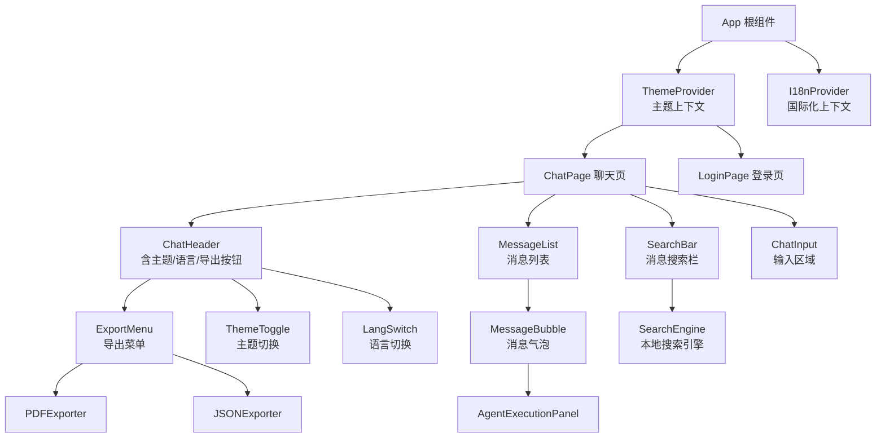
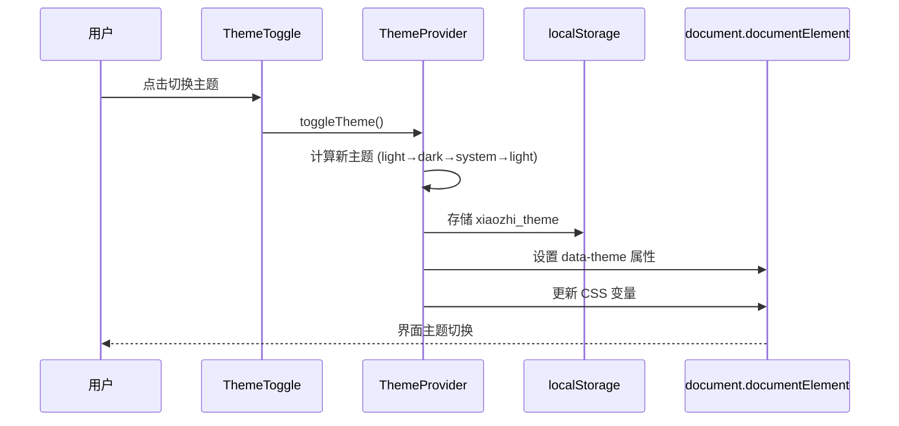
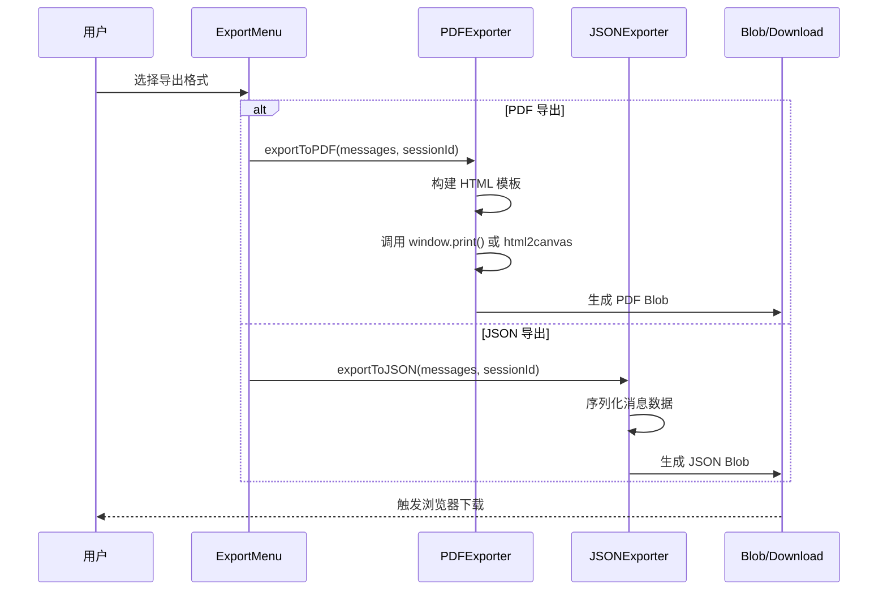

# 设计文档：前端体验增强（Frontend Experience Enhancement）

## 概述

本设计文档描述"小智 AI 智能客服"系统前端体验增强方案。当前前端基于 React 18 + TypeScript + Ant Design + Tailwind CSS 构建，已实现基础聊天、登录、SSE 流式通信、Agent 执行可视化和 Prometheus 监控面板等功能。

本次增强覆盖五大方向：
1. **暗色模式（Dark Mode）**：支持亮色/暗色主题切换，跟随系统偏好或手动切换
2. **对话导出**：支持将聊天记录导出为 PDF 和 JSON 格式
3. **消息搜索与历史筛选**：支持关键词搜索、按时间/类型筛选历史消息
4. **移动端适配优化**：响应式布局，触控交互优化，移动端专属 UI 调整
5. **多语言 UI 切换**：国际化支持，从纯中文扩展到中/英双语（可扩展更多语言）

### 设计原则

- **渐进式增强**：在现有 `App.tsx` 单文件架构上增量添加，通过 React Context 注入全局能力
- **零破坏性**：所有新功能通过独立模块实现，不修改现有核心聊天逻辑
- **用户偏好持久化**：主题、语言等偏好存储在 localStorage，刷新后保持
- **移动优先**：响应式设计以移动端为基准向上适配

## 架构

### 整体架构图



### 主题切换时序图



### 对话导出时序图



### 消息搜索时序图

```mermaid
sequenceDiagram
    participant U as 用户
    participant SB as SearchBar
    participant SE as SearchEngine
    participant ML as MessageList

    U->>SB: 输入搜索关键词
    SB->>SB: 防抖 300ms
    SB->>SE: search(keyword, filters)
    SE->>SE: 遍历消息数组匹配
    SE->>SE: 应用时间/角色筛选
    SE-->>SB: 匹配结果 + 高亮位置
    SB->>ML: 更新 filteredMessages
    ML-->>U: 显示筛选结果 + 关键词高亮
```



## 组件与接口

### 组件 1：ThemeProvider（主题提供者）

**职责**：管理全局主题状态，提供主题切换能力，同步 CSS 变量

```typescript
type ThemeMode = 'light' | 'dark' | 'system';

interface ThemeContextValue {
  theme: ThemeMode;
  resolvedTheme: 'light' | 'dark';  // system 解析后的实际主题
  toggleTheme: () => void;
  setTheme: (theme: ThemeMode) => void;
}
```

**职责清单**：
- 从 localStorage 读取用户主题偏好
- 监听系统 `prefers-color-scheme` 媒体查询变化
- 切换时更新 `document.documentElement` 的 `data-theme` 属性
- 同步 Ant Design 的 `ConfigProvider` 主题 token

### 组件 2：I18nProvider（国际化提供者）

**职责**：管理多语言状态，提供翻译函数

```typescript
type Locale = 'zh-CN' | 'en-US';

interface I18nContextValue {
  locale: Locale;
  setLocale: (locale: Locale) => void;
  t: (key: string, params?: Record<string, string | number>) => string;
}

// 翻译资源结构
type TranslationResource = Record<Locale, Record<string, string>>;
```

**职责清单**：
- 从 localStorage 读取语言偏好，默认 `zh-CN`
- 提供 `t()` 翻译函数，支持参数插值
- 语言切换时同步 Ant Design 的 locale 配置

### 组件 3：SearchBar（搜索栏）

**职责**：提供消息搜索和筛选 UI

```typescript
interface SearchFilters {
  keyword: string;
  role?: 'user' | 'assistant' | 'all';
  dateRange?: [number, number];  // [startTimestamp, endTimestamp]
  hasMetadata?: boolean;         // 仅含元数据的消息
}

interface SearchResult {
  messageId: string;
  matchPositions: [number, number][];  // [start, end] 高亮位置
}

interface SearchBarProps {
  messages: ChatMessage[];
  onFilterChange: (filtered: ChatMessage[], highlights: Map<string, [number, number][]>) => void;
  visible: boolean;
  onClose: () => void;
}
```

### 组件 4：ExportMenu（导出菜单）

**职责**：提供对话导出功能入口

```typescript
interface ExportOptions {
  format: 'pdf' | 'json';
  includeMetadata: boolean;
  includeAgentEvents: boolean;
  dateRange?: [number, number];
}

interface ExportMenuProps {
  messages: ChatMessage[];
  sessionId?: string;
  disabled?: boolean;
}
```

## 数据模型

### 主题配置模型

```typescript
interface ThemeConfig {
  mode: ThemeMode;
  // CSS 变量映射
  cssVariables: {
    '--bg-primary': string;
    '--bg-secondary': string;
    '--text-primary': string;
    '--text-secondary': string;
    '--border-color': string;
    '--accent-color': string;
    '--msg-user-bg': string;
    '--msg-bot-bg': string;
    '--input-bg': string;
    '--shadow-color': string;
  };
}
```

**验证规则**：
- `mode` 必须为 `'light' | 'dark' | 'system'` 之一
- 所有 CSS 变量值必须为合法 CSS 颜色值

### 翻译资源模型

```typescript
interface TranslationEntry {
  key: string;           // 翻译键，如 'chat.welcome.title'
  zh_CN: string;         // 中文翻译
  en_US: string;         // 英文翻译
  params?: string[];     // 可选参数列表，如 ['username']
}
```

**验证规则**：
- 每个 key 在所有语言中必须有对应翻译
- 含参数的翻译必须在所有语言版本中包含相同的参数占位符 `{paramName}`

### 导出数据模型

```typescript
interface ExportedConversation {
  version: '1.0';
  exportedAt: string;       // ISO 8601
  sessionId?: string;
  locale: Locale;
  messageCount: number;
  messages: ExportedMessage[];
}

interface ExportedMessage {
  role: 'user' | 'assistant';
  content: string;
  timestamp: string;         // ISO 8601
  metadata?: ChatMetadata;
  agentEvents?: AgentEvent[];
}
```

**验证规则**：
- `version` 固定为 `'1.0'`
- `messages` 数组不能为空
- 每条消息的 `timestamp` 必须为合法 ISO 8601 格式


## 算法伪代码与形式化规约

### 算法 1：主题切换

```typescript
function toggleTheme(current: ThemeMode): ThemeMode {
  // 循环切换：light → dark → system → light
  const cycle: ThemeMode[] = ['light', 'dark', 'system'];
  const idx = cycle.indexOf(current);
  return cycle[(idx + 1) % cycle.length];
}

function resolveTheme(mode: ThemeMode): 'light' | 'dark' {
  if (mode === 'system') {
    return window.matchMedia('(prefers-color-scheme: dark)').matches ? 'dark' : 'light';
  }
  return mode;
}

function applyTheme(resolved: 'light' | 'dark'): void {
  const root = document.documentElement;
  root.setAttribute('data-theme', resolved);
  // 更新 CSS 变量
  const vars = THEME_CONFIGS[resolved].cssVariables;
  for (const [key, value] of Object.entries(vars)) {
    root.style.setProperty(key, value);
  }
}
```

**前置条件**：
- `current` 为合法 `ThemeMode` 值
- `THEME_CONFIGS` 已定义 `light` 和 `dark` 两套配置

**后置条件**：
- `toggleTheme` 返回值必定是 `ThemeMode` 中的下一个值
- `resolveTheme` 返回值只能是 `'light'` 或 `'dark'`
- `applyTheme` 执行后 `document.documentElement.dataset.theme` 等于 `resolved`

**循环不变量**：无循环

### 算法 2：消息搜索引擎

```typescript
function searchMessages(
  messages: ChatMessage[],
  filters: SearchFilters
): SearchResult[] {
  const results: SearchResult[] = [];
  const keyword = filters.keyword.toLowerCase().trim();

  for (const msg of messages) {
    // 不变量：results 中所有条目均满足筛选条件

    // 角色筛选
    if (filters.role && filters.role !== 'all' && msg.role !== filters.role) {
      continue;
    }

    // 时间范围筛选
    if (filters.dateRange) {
      const [start, end] = filters.dateRange;
      if (msg.timestamp < start || msg.timestamp > end) {
        continue;
      }
    }

    // 元数据筛选
    if (filters.hasMetadata && !msg.metadata) {
      continue;
    }

    // 关键词匹配
    if (keyword) {
      const content = msg.content.toLowerCase();
      const positions: [number, number][] = [];
      let searchFrom = 0;

      while (searchFrom < content.length) {
        const idx = content.indexOf(keyword, searchFrom);
        if (idx === -1) break;
        positions.push([idx, idx + keyword.length]);
        searchFrom = idx + 1;
      }

      if (positions.length === 0) continue;
      results.push({ messageId: msg.id, matchPositions: positions });
    } else {
      // 无关键词时，通过筛选即匹配
      results.push({ messageId: msg.id, matchPositions: [] });
    }
  }

  return results;
}
```

**前置条件**：
- `messages` 为合法 `ChatMessage[]` 数组（可为空）
- `filters.keyword` 为字符串（可为空）
- 若 `filters.dateRange` 存在，则 `dateRange[0] <= dateRange[1]`

**后置条件**：
- 返回的 `SearchResult[]` 中每个 `messageId` 都存在于原 `messages` 中
- 若 `keyword` 非空，每个结果的 `matchPositions` 至少有一个匹配位置
- 结果保持原消息的相对顺序

**循环不变量**：
- 外层循环：`results` 中所有已添加条目均满足角色、时间、元数据筛选条件
- 内层循环（关键词匹配）：`searchFrom` 单调递增，`positions` 中所有区间不重叠

### 算法 3：JSON 导出

```typescript
function exportToJSON(
  messages: ChatMessage[],
  sessionId: string | undefined,
  options: ExportOptions
): string {
  const exported: ExportedConversation = {
    version: '1.0',
    exportedAt: new Date().toISOString(),
    sessionId,
    locale: getCurrentLocale(),
    messageCount: messages.length,
    messages: messages.map(msg => {
      const entry: ExportedMessage = {
        role: msg.role,
        content: msg.content,
        timestamp: new Date(msg.timestamp).toISOString(),
      };
      if (options.includeMetadata && msg.metadata) {
        entry.metadata = msg.metadata;
      }
      if (options.includeAgentEvents && msg.agentEvents) {
        entry.agentEvents = msg.agentEvents;
      }
      return entry;
    }),
  };

  return JSON.stringify(exported, null, 2);
}
```

**前置条件**：
- `messages` 非空数组
- 每条消息的 `timestamp` 为合法 Unix 毫秒时间戳

**后置条件**：
- 返回值为合法 JSON 字符串
- 解析后 `version` 为 `'1.0'`
- `messageCount` 等于 `messages` 数组长度
- 若 `includeMetadata` 为 false，导出消息中不含 `metadata` 字段

**循环不变量**：无显式循环（map 操作保证逐条转换）

### 算法 4：PDF 导出

```typescript
function exportToPDF(
  messages: ChatMessage[],
  sessionId: string | undefined,
  options: ExportOptions
): void {
  // 构建可打印 HTML
  const html = buildPrintableHTML(messages, sessionId, options);

  // 创建隐藏 iframe
  const iframe = document.createElement('iframe');
  iframe.style.display = 'none';
  document.body.appendChild(iframe);

  const doc = iframe.contentDocument!;
  doc.open();
  doc.write(html);
  doc.close();

  // 等待渲染完成后触发打印
  iframe.contentWindow!.onafterprint = () => {
    document.body.removeChild(iframe);
  };
  iframe.contentWindow!.print();
}

function buildPrintableHTML(
  messages: ChatMessage[],
  sessionId: string | undefined,
  options: ExportOptions
): string {
  // 生成包含样式的完整 HTML 文档
  // 包含：标题、会话 ID、导出时间、消息列表
  // 每条消息显示：角色标签、内容、时间戳
  // 可选：元数据标签、Agent 执行步骤
  return `<!DOCTYPE html>...`;  // 完整 HTML 模板
}
```

**前置条件**：
- `messages` 非空数组
- 浏览器支持 `window.print()` API

**后置条件**：
- 触发浏览器打印对话框
- 打印完成后清理临时 iframe 元素
- 不修改原始消息数据

### 算法 5：翻译函数

```typescript
function translate(
  key: string,
  locale: Locale,
  resources: TranslationResource,
  params?: Record<string, string | number>
): string {
  const localeResources = resources[locale];
  if (!localeResources) return key;

  let text = localeResources[key];
  if (text === undefined) return key;  // 未找到翻译，返回 key 本身

  // 参数插值
  if (params) {
    for (const [paramKey, paramValue] of Object.entries(params)) {
      text = text.replace(new RegExp(`\\{${paramKey}\\}`, 'g'), String(paramValue));
    }
  }

  return text;
}
```

**前置条件**：
- `key` 为非空字符串
- `locale` 为已注册的语言代码
- `resources` 包含 `locale` 对应的翻译映射

**后置条件**：
- 若 key 存在于资源中，返回翻译后的文本
- 若 key 不存在，返回 key 本身（降级策略）
- 所有 `{paramName}` 占位符被替换为对应参数值

**循环不变量**：
- 参数替换循环中，每次迭代替换一个参数，已替换的参数不会被后续替换破坏（参数名不含 `{}`）

## 关键函数形式化规约

### `useTheme()` Hook

```typescript
function useTheme(): ThemeContextValue
```

**前置条件**：
- 必须在 `ThemeProvider` 子树内调用

**后置条件**：
- 返回当前主题状态和切换方法
- `resolvedTheme` 始终为 `'light'` 或 `'dark'`
- 调用 `toggleTheme()` 后，下一次渲染 `theme` 值改变

### `useI18n()` Hook

```typescript
function useI18n(): I18nContextValue
```

**前置条件**：
- 必须在 `I18nProvider` 子树内调用

**后置条件**：
- `t(key)` 对于已注册的 key 返回当前语言的翻译
- `setLocale()` 调用后，所有使用 `t()` 的组件重新渲染

### `useMessageSearch()` Hook

```typescript
function useMessageSearch(messages: ChatMessage[]): {
  filters: SearchFilters;
  setFilters: (filters: Partial<SearchFilters>) => void;
  results: SearchResult[];
  filteredMessages: ChatMessage[];
  isSearching: boolean;
}
```

**前置条件**：
- `messages` 为合法数组

**后置条件**：
- `filteredMessages` 是 `messages` 的子集，保持原始顺序
- `results.length === filteredMessages.length`
- 修改 `filters` 后 300ms 内更新结果（防抖）

## 示例用法

### 主题切换

```typescript
// 在组件中使用主题
function ChatHeader() {
  const { theme, resolvedTheme, toggleTheme } = useTheme();
  const { t } = useI18n();

  return (
    <div className="chat-header">
      <span>{t('chat.header.title')}</span>
      <button onClick={toggleTheme} aria-label={t('theme.toggle')}>
        {resolvedTheme === 'dark' ? '🌙' : '☀️'}
      </button>
    </div>
  );
}
```

### 消息搜索

```typescript
function ChatPage() {
  const [messages] = useState<ChatMessage[]>([]);
  const { filters, setFilters, filteredMessages, isSearching } = useMessageSearch(messages);

  return (
    <>
      <SearchBar
        visible={showSearch}
        onKeywordChange={(kw) => setFilters({ keyword: kw })}
        onRoleFilter={(role) => setFilters({ role })}
      />
      <MessageList
        messages={isSearching ? filteredMessages : messages}
        highlights={isSearching ? highlights : undefined}
      />
    </>
  );
}
```

### 对话导出

```typescript
function ExportMenu({ messages, sessionId }: ExportMenuProps) {
  const { t } = useI18n();

  const handleExport = (format: 'pdf' | 'json') => {
    const options: ExportOptions = {
      format,
      includeMetadata: true,
      includeAgentEvents: true,
    };

    if (format === 'json') {
      const json = exportToJSON(messages, sessionId, options);
      downloadBlob(new Blob([json], { type: 'application/json' }), `chat-${sessionId?.slice(0, 8)}.json`);
    } else {
      exportToPDF(messages, sessionId, options);
    }
  };

  return (
    <Dropdown menu={{ items: [
      { key: 'pdf', label: t('export.pdf'), onClick: () => handleExport('pdf') },
      { key: 'json', label: t('export.json'), onClick: () => handleExport('json') },
    ]}}>
      <button>{t('export.button')}</button>
    </Dropdown>
  );
}
```

### 多语言切换

```typescript
function LangSwitch() {
  const { locale, setLocale, t } = useI18n();

  return (
    <button onClick={() => setLocale(locale === 'zh-CN' ? 'en-US' : 'zh-CN')}>
      {locale === 'zh-CN' ? 'EN' : '中'}
    </button>
  );
}
```


## 正确性属性

以下属性以全称量化形式描述系统的正确性约束：

### 主题系统

1. **主题持久化一致性**：∀ theme ∈ ThemeMode, 调用 `setTheme(theme)` 后刷新页面，`localStorage.getItem('xiaozhi_theme')` 返回 `theme`，且 UI 渲染使用该主题
2. **主题解析确定性**：∀ mode ∈ ThemeMode, `resolveTheme(mode)` 的返回值 ∈ `{'light', 'dark'}`
3. **主题循环完整性**：从任意 ThemeMode 出发，连续调用 3 次 `toggleTheme()`，回到初始值
4. **CSS 变量同步性**：∀ resolved ∈ {'light', 'dark'}, `applyTheme(resolved)` 后，`document.documentElement` 上的所有 CSS 变量与 `THEME_CONFIGS[resolved]` 一致

### 搜索系统

5. **搜索结果子集性**：∀ filters, `searchMessages(messages, filters)` 返回的每个 `messageId` 都存在于 `messages` 中
6. **搜索顺序保持性**：∀ filters, 搜索结果中消息的相对顺序与原 `messages` 数组一致
7. **空关键词全匹配**：∀ messages, 当 `filters.keyword === ''` 且无其他筛选条件时，结果数量等于 `messages.length`
8. **高亮位置有效性**：∀ result ∈ SearchResult, ∀ [start, end] ∈ result.matchPositions, `0 <= start < end <= message.content.length`

### 导出系统

9. **JSON 导出可逆性**：∀ messages, `JSON.parse(exportToJSON(messages, sid, opts))` 返回合法 `ExportedConversation` 对象
10. **导出消息计数一致性**：∀ exported, `exported.messageCount === exported.messages.length`
11. **元数据包含控制**：当 `options.includeMetadata === false` 时，∀ msg ∈ exported.messages, `msg.metadata === undefined`

### 国际化系统

12. **翻译键降级**：∀ key, 若 key 不存在于当前语言资源中，`t(key)` 返回 key 本身
13. **参数插值完整性**：∀ key, params, 若翻译文本含 `{paramName}` 且 `params` 含 `paramName`，则返回文本中不含 `{paramName}`
14. **语言切换一致性**：∀ locale, 调用 `setLocale(locale)` 后，所有 `t()` 调用使用新 locale 的翻译资源

### 移动端适配

15. **响应式断点正确性**：∀ viewport width < 768px, 聊天容器宽度为 100%，无水平滚动
16. **触控目标尺寸**：∀ 可交互元素在移动端视口下，最小触控区域 ≥ 44×44px

## 错误处理

### 场景 1：PDF 导出失败

**条件**：浏览器不支持 `window.print()` 或 iframe 创建失败
**响应**：捕获异常，显示 Toast 提示"导出失败，请尝试 JSON 格式"
**恢复**：清理可能创建的临时 DOM 元素

### 场景 2：翻译资源缺失

**条件**：请求的翻译 key 在当前语言中不存在
**响应**：返回 key 本身作为降级文本，控制台输出 warning
**恢复**：不影响 UI 渲染，用户看到 key 字符串

### 场景 3：localStorage 不可用

**条件**：隐私模式或存储已满
**响应**：主题/语言偏好使用内存状态，不持久化
**恢复**：下次访问使用默认值（light 主题、zh-CN 语言）

### 场景 4：搜索性能降级

**条件**：消息数量超过 1000 条，搜索响应时间 > 100ms
**响应**：显示搜索中 loading 状态
**恢复**：使用 Web Worker 或分页搜索策略

## 测试策略

### 单元测试

- 主题切换逻辑：`toggleTheme` 循环、`resolveTheme` 解析、CSS 变量应用
- 搜索引擎：关键词匹配、筛选组合、高亮位置计算、空输入处理
- 导出功能：JSON 序列化格式、元数据包含/排除、时间戳格式化
- 翻译函数：key 查找、参数插值、缺失 key 降级

### 属性测试（Property-Based Testing）

**测试库**：fast-check（已在 devDependencies 中）

- 主题循环属性：任意起始主题，3 次 toggle 回到原点
- 搜索子集属性：任意消息数组和筛选条件，结果是输入的子集
- JSON 导出可逆属性：任意消息数组，导出后解析结果结构正确
- 翻译降级属性：任意随机 key，不存在时返回 key 本身

### 集成测试

- 主题切换后 Ant Design 组件样式正确应用
- 语言切换后所有可见文本更新
- 移动端视口下布局不溢出
- 导出文件可被外部工具正确解析

## 性能考量

- **搜索防抖**：输入防抖 300ms，避免每次按键触发搜索
- **虚拟滚动**：消息列表超过 200 条时考虑虚拟滚动（后续优化）
- **CSS 变量切换**：主题切换通过 CSS 变量实现，避免组件重渲染
- **翻译缓存**：翻译资源在初始化时加载，运行时 O(1) 查找
- **PDF 导出**：使用 iframe + print 方案，无需额外依赖，包体积零增长

## 安全考量

- **XSS 防护**：导出 PDF 时对消息内容进行 HTML 转义
- **JSON 导出**：使用 `JSON.stringify` 自动转义特殊字符
- **localStorage**：仅存储非敏感偏好数据（主题、语言），不存储 token 以外的认证信息

## 依赖

### 现有依赖（无需新增）
- `react` ^18.3.1 — 核心框架
- `antd` ^6.3.5 — UI 组件库（ConfigProvider 主题支持、Dropdown、Rate 等）
- `react-markdown` ^9.0.1 — Markdown 渲染
- `fast-check` ^4.6.0 — 属性测试（已有）

### 可选新增依赖
- 无强制新增依赖。PDF 导出使用浏览器原生 `window.print()`，国际化使用自建轻量方案
- 若后续需要更复杂的 PDF 排版，可考虑 `html2canvas` + `jspdf`
